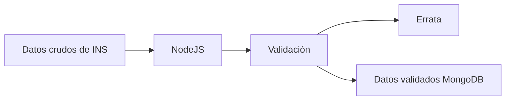

# Colev API

Aplicación para extraer, procesar y administrar los datos sobre Covid-19 en Colombia para las diferentes aplicaciones de investigación en el grupo [Colev](https://colev.uniandes.edu.co/) de la Universidad de los Andes.

## Aplicaciones

- Base de datos: Mongo
- Cache: Redis
- Api: NodeJS (Fastify)
- Sitio web: Vue

### Contenedores de Docker

#### Desarrollo local

Para desarrollo local incluimos mongo-express (Ver `docker-compose.desarrollo.yml`).

Iniciar contenedores con:

```bash
docker compose -f docker-compose.desarrollo.yml up -d
```

#### Producción (comando en servidor)

En modo de producción no se necesita mongo-express (Ver `docker-compose.yml`)

```bash
docker compose up -d
```

### Proceso de validación



## Instalación

```bash
yarn
```

## Desarrollo local

### Crear Token

1. Ingresar o registrarse en el portal de datos abiertos de Colombia Tokens de App [https://www.datos.gov.co/profile/edit/developer_settings](https://www.datos.gov.co/profile/edit/developer_settings).
2. En la sección **"Tokens de App"**, seleccionar la opción **"Crear nueva aplicación"**.
3. Luego de llenar la información de la aplicación, copiar el token público que se encuentra en **"Autentificador de la aplicación"**
4. En los archivos locales, hacer una copia del archivo `.env.ejemplo` y llamarlo `.env`. Allí pegar el Token que acaba de copiar en la variable `TOKEN=`

o crear el archivo `.env` directamente con la variable:

```bash
TOKEN=.....
```

### Iniciar en modo de desarrollo

```bash
yarn dev
```

### Rutas

Para acceder a las diferentes fuentes de datos, ver las rutas que se definen en el archivo `./servidor.js`. Cada ruta comienza con `servidor.get('/' ...`.

Por ejemplo, en `servidor.js` esta la siguiente ruta que se puede acceder desde [localhost:3000/descriptores](http://localhost:3000/descriptores):

```js
servidor.get('/descriptores', async (request, reply) => {
  const descriptores = await readFile('./datos/descriptores.json');

  return JSON.parse(descriptores);
});
```

Revisar 1 caso por id: https://www.datos.gov.co/resource/gt2j-8ykr.json?id_de_caso=5666290

### Agregar paquetes a las aplicaciones

Este repositorio contiene varias aplicaciones usando Yarn Worspaces. Para instalar paquetes de NPM se debe dirigir a la aplicación que le corresponde. Por ejemplo:

Este comando...

```bash
yarn add ...
```

Se vuelve esto para instalar un paquete a la aplicación llamada `servidor`

```bash
 yarn workspace servidor add ...
```

Y este para la aplicación `sitio`

```bash
 yarn workspace sitio add ...
```

- paleta de color
- hover mostrar tiempo
- mostrar porcentaje o valor que le da el tamaño a las palabras

Para definir la cantidad de entradas por página en el extractor de datos de INS se puede pasar la variable ambiente `CANTIDAD`

```bash
CANTIDAD=500 yarn ins
```

También se puede definir la página de inicio con variable `PAGINA`

```bash
CANTIDAD=500 PAGINA=230 yarn ins
```
